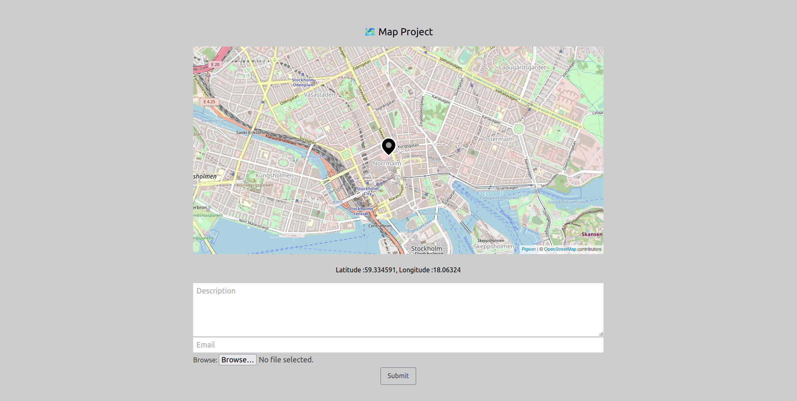
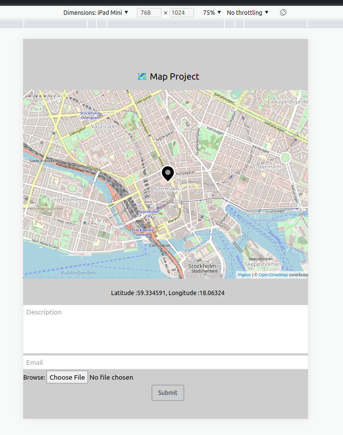
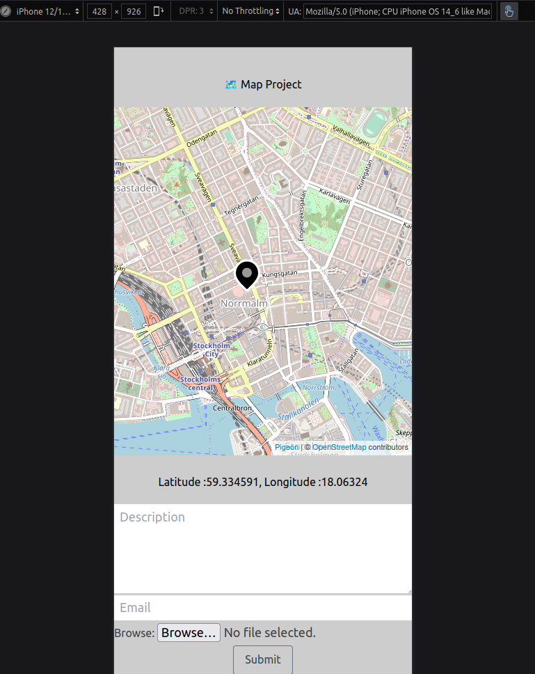
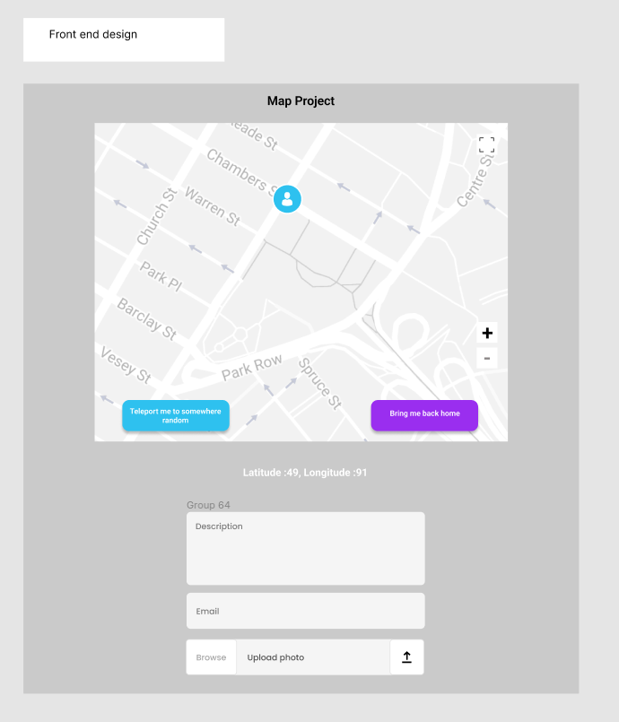

# Live on https://wodsuz.github.io/mapProject/

Create a small frontend application with React.js and Typescript:
You should be able to write a recipient email address, some text, and add an image
attachment.

# Used Technologies

- React.js: Main framework
- Tailwind: CSS preprocessor
- Pigeon: To display map
- Typescript

# The look

Large Screen

Tablet View

Mobile View

# Design

Front end Design

